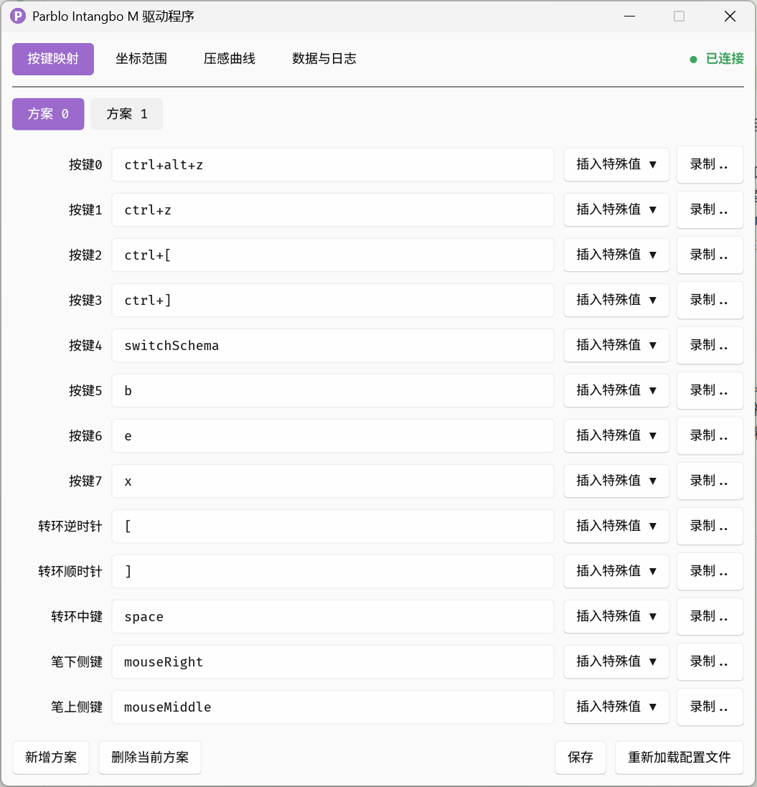
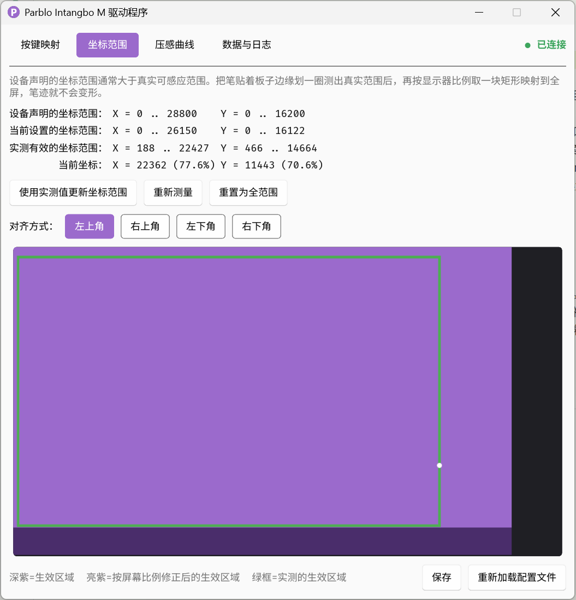
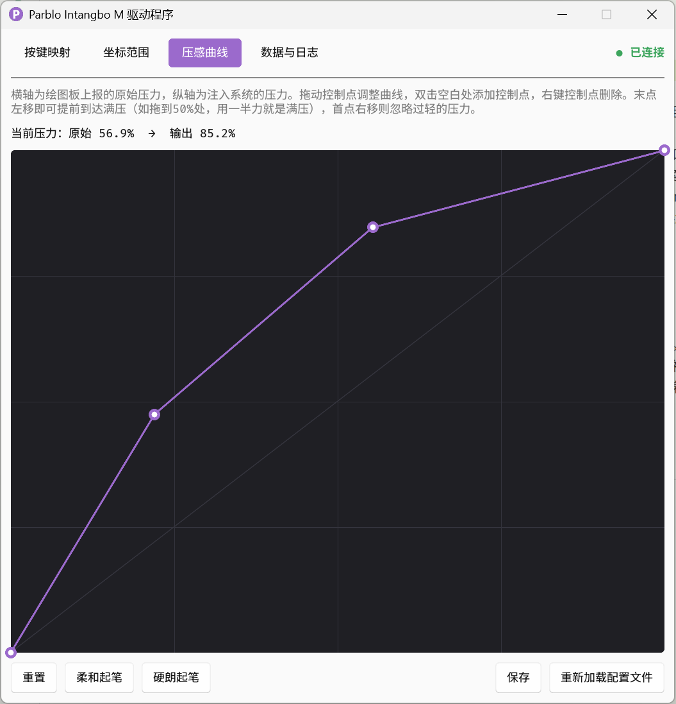
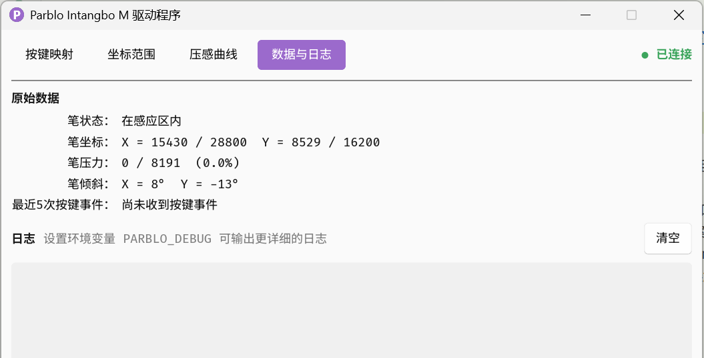

「Parblo Intangbo M」绘图板的Windows用户态驱动程序，通过HID API访问设备、经Windows Ink注入笔事件，并提供图形界面。只有一个可执行文件，不需要安装系统驱动，也不需要管理员权限，仅实现了官方驱动中我认为最核心的功能。

迁移自这个[Linux版本](https://github.com/dfxyz/parblo-intangbo-m-driver)（内含该绘图板的协议细节说明文档）；因为调用的系统API不一样，所以没有共用代码。

## 功能

### 按键映射

绘图板上8个按键、转环的三个动作、笔上两个侧键，一共13项，每一项都能映射成键盘按键组合或鼠标按键。

- **多套方案**：可以建任意多套映射，用绘图板上的某个按键在方案之间轮换
- **沿用上一套**：某一项填`fallback`就会逐级向前查找，直到遇到真正设了值的方案；适合「基础方案+少量差异」的组织方式
- **录制快捷键**：点「录制」然后直接按下想要的组合键，自动填好
- **即时校验**：填了无法识别的值，输入框会套上红框，同时驱动按「未映射」处理，不会误触发



### 坐标范围

设备声明的坐标范围有可能大于实际可感应的范围，因此需要对坐标范围进行校准。

- **实测校准**：把笔贴着板子边缘划一圈，程序记下真正到达过的极值，点一下就填进配置
- **按屏幕比例修正**：在实际有效区域中取一块符合显示器宽高比的矩形映射到全屏，保证笔迹不会拉伸变形
- **示意图**：底部实时画出生效区域、修正后的区域、实测区域三者的关系



### 压感曲线

横轴是绘图板上报的原始压力，纵轴是注入系统的压力，中间用一条折线自由映射。

- 拖动控制点调整，双击空白处加点，右键控制点删点
- 末点左移就能提前到达满压，比如拖到50%处，用一半力气就是满压
- 首点右移则忽略过轻的压力，避免手悬着蹭出笔迹
- 两个参考预设曲线：柔和起笔、硬朗起笔



### 数据与日志

查看设备实时上报的原始数据——笔的状态、坐标、压力、倾斜角，以及最近5次按键事件；或查看程序的运行日志



### 其它功能

- **常驻托盘**：关闭窗口只是收起来，驱动继续跑；点击托盘图标可以切换窗口显示
- **热插拔**：拔掉再插上绘图板会自动重新握手，不用重启程序
- **单实例**：重复启动不会开出第二个进程，而是把已有窗口唤回来

## 使用

编译：

```
cargo build --release
```

产物是单个exe文件。默认读取与它同目录、同主文件名的配置文件，例如`parblo.exe`对应`parblo.toml`；改exe名字时记得把配置文件一起改。配置文件不存在也能启动，只是会使用空配置。

命令行参数只有一个：

| 参数 | 作用 |
| --- | --- |
| `-d` | 启动时不显示窗口，只留托盘图标（配置随系统自动启动时记得带上它） |

设置环境变量 `PARBLO_DEBUG` 可以让日志页输出更详细的内容，包括握手报文和抽样的笔事件。

## 已知限制

- **只认这一款设备**，VID/PID与握手报文都是写死的，如果想用于「Parblo Intangbo S」需要修改源码
- **压感被压缩到1024级**：设备本身能上报8192级压感，但Windows Ink的合成笔接口上限就是1024；但实际使用中基本感觉不到差异，可以忍
- **单显示器假设**：坐标映射按虚拟屏幕的整体尺寸计算，多显示器环境下的使用可能会有问题
- **程序退出后绘图板会失灵**：握手后设备就不再使用标准HID接口，因此程序退出后绘图板不再上报任何事件，表现为失灵（官方驱动也有相同的问题）
